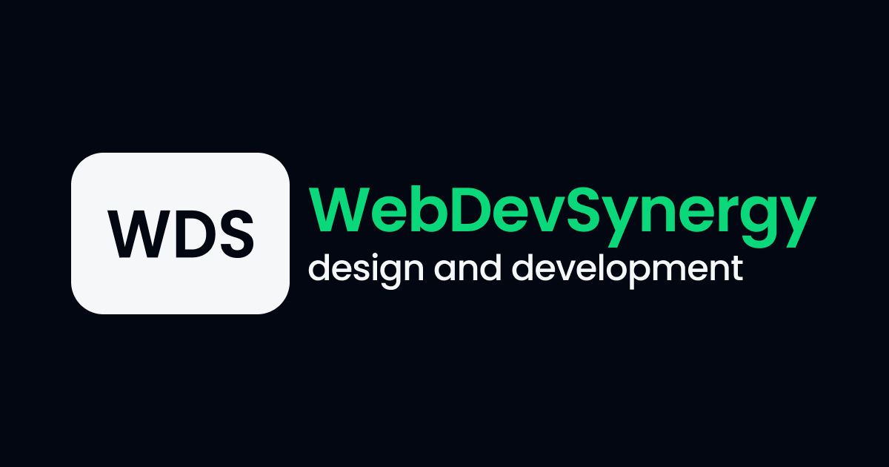

# WebDevSynergy 💻

**[View live page](https://webdevsynergy.com.ua)**

## 🗂️ Як працювати з проєктом? 🗂️

1. Склонувати проєкт
2. Стягнути всі оновленн - git push origin dev
3. Створити нову гілку та перейти в неї git checkout -b feature/test-branch
   (Правила неймінгу див. нижче)
4. Працюємо до моменту коли потрібно закомітити
5. Робимо git add .
6. Робимо git commit -m "add test-feature" - на цьому етапі повинна запуститись
   Husky та перевірити валідність коду, якщо все ок, зʼявиться ось таке:
   ✅✅✅✅ Кіт ✅✅✅✅. Якщо не ок, напише про помилки, які потрібно виправити
   і знову зробити коміт (КОМІТ НЕ БУДЕ ЗРОБЛЕНО ПОКИ НЕ ВИПРАВЛЕНО ПОМИЛКИ)
7. Стягуємо оновлення git pull origin dev
8. Якщо є конфлікти, резолвимо їх, а якщо немає пушимо в свою гілку - git push
   origin feture/test-branch 
9. Переходимо на GitHub і створюємо пулреквест в гілку dev!!!

## 📕 Правила неймінгу гілок 📕

Тут все просто 😉

Якщо гілка призначена для нової таски (фічі) то гілку називаємо фіча/назва-фічі,
наприклад: таска створення слайдера - feature/slider або таска додавання
головного заголовка - feature/main-title 

Якщо гілка призначена для виправлення багу то гілку називаємо багфіх/назва-фічі,
наприклад: потрібно пофіксити слайдер - bugfix/slider

---

